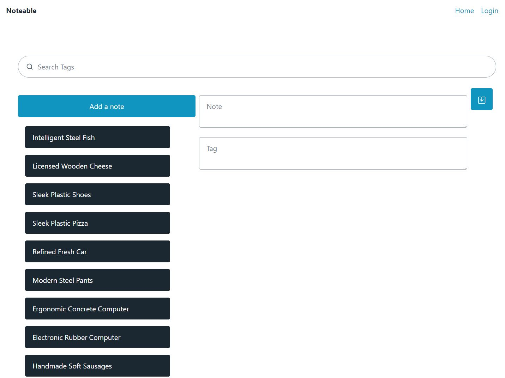

# Note-sharing

## Technologies Used

| Technology Used         | Resource URL           | 
| ------------- |:-------------:| 
| Javascript    | [https://developer.mozilla.org/en-US/docs/Web/JavaScript](https://developer.mozilla.org/en-US/docs/Web/JavaScript) | 
| HTML    | [https://developer.mozilla.org/en-US/docs/Web/HTML](https://developer.mozilla.org/en-US/docs/Web/HTML) |   
| Git | [https://www.w3schools.com/git/default.asp](https://www.w3schools.com/git/default.asp)     |  
| Fuse JS | [https://fusejs.io/](https://fusejs.io/)     |  
| Pico CSS | [https://picocss.com/](https://picocss.com/)     |  
| FAKER JS | [https://fakerjs.dev/](https://fakerjs.dev/)     |  
| Quill JS | [https://quilljs.com/](https://quilljs.com/)     |  

## Description

    With noteable, you can easily organize your thoughts and ideas in one convenient place. 
    Whether you're jotting down ideas for a project, making a to-do list, or keeping track 
    of important information, noteable has got you covered.With features like sharing between 
    users, searching, and you'll never lose track of what's important again. 
    Get noteable today and simplify your note-taking experience.

Here is the [deploy link](https://ancient-hollows-85855.herokuapp.com/)

## Table of Contents (Optional)

- [Installation](#installation)
- [Usage](#usage)
- [License](#license)
- [Contributing](#contributing)
- [Tests](#tests)

## Installation

To install necessary dependencies, run the following command: 

    run mysql -u root -p
    source db/schema.sql;
    quit
    npm install  

## Usage

Step 1: Sign up for an account, here is the [link](https://ancient-hollows-85855.herokuapp.com/)

Step 2: Create your notes, and add tags to them for tracking.

example:

Here is what happening in diagrams perspective: 

Here is simplicity view of models and relationships: 

## Team Members Info

The groups github links:

[Milton Ly](https://github.com/MiltonLy)

[Brian Zhao](https://github.com/byxzESC)

[Ian Senne](https://github.com/IanSSenne)

## License

/*
 * ----------------------------------------------------------------------------
 * "THE BEER-WARE LICENSE" (Revision 42):
 * <phk@FreeBSD.ORG> wrote this file.  As long as you retain this notice you
 * can do whatever you want with this stuff. If we meet some day, and you think
 * this stuff is worth it, you can buy me a beer in return.   Notable Team
 * ----------------------------------------------------------------------------
 */

## How to Contribute

N/A

## Tests

N/A

## Credit

All this coding made possible by [Jerome Chenette](https://github.com/jeromechenette) and our fellow students who help each other along the way
